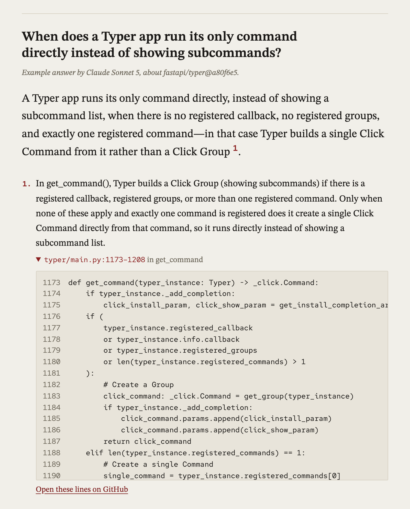

# repolens

[](https://github.com/AnshChhikara001/repolens/actions/workflows/ci.yml)
[](LICENSE)

**Ask a question about a GitHub repository and get an answer where every claim cites `file:line`, checked against the pinned commit.**

repolens is an agentic code Q&A tool. One agent searches and reads the code until it can answer, a deterministic verifier drops every citation to lines the model wasn't shown, and a pinned eval measures how often it finds the right code. It's plain Python with a small model layer for Gemini and Claude and no agent framework, so every step is explainable.



## Results

29 questions on five pinned repositories: [`fastapi/typer`](https://github.com/fastapi/typer), [`pallets/flask`](https://github.com/pallets/flask) and [`encode/httpx`](https://github.com/encode/httpx) (Python), [`sindresorhus/ky`](https://github.com/sindresorhus/ky) and [`colinhacks/zod`](https://github.com/colinhacks/zod) (TypeScript), each with the files and symbols a good answer cites ([`evals/questions.toml`](evals/questions.toml)). One-shot means the model answers from the first search alone. Two runs per setup (one for Sonnet 5 one-shot). **[The short write-up](evals/README.md)** explains the method and the misses in two minutes.

| Model | Setup | File recall | Symbol recall | Citation validity | Input tokens | Run time | Est. cost |
|---|---|---|---|---|---|---|---|
| Gemini 3.1 Flash-Lite | one-shot | 72% | 52% | 100% | 5,184 | 7.9s | $0.0020 |
| Gemini 3.1 Flash-Lite | agent | 84% | 72% | 100% | 13,751 | 12.1s | $0.0042 |
| Claude Sonnet 5 | one-shot | 69% | 50% | 100% | 7,611 | 16.3s | $0.0247 |
| Claude Sonnet 5 | agent | **93–97%** | **86–91%** | 97–99% | 22,354 | 27.6s | $0.0580 |

Recorded 2026-10-03, with no errors in any Run. Tokens, time and cost are means per question; cost is estimated at list prices.

- **Searching and reading beats answering from one search.** On Claude Sonnet 5 the agent finds 93–97% of the expected files, against 69% one-shot, for about 3x the tokens.
- **Gemini 3.1 Flash-Lite needs a push to look.** Requiring one Tool call before the answer took its file recall on typer and ky from 66–71% to 78%; it still answers right after that call in most Runs.
- **Citations stay valid.** The verifier kept 97–100% of Citations in every setup and run.
- **Ranking tests last helps every setup.** Test files that use the question's words used to fill the search results. With tests after all other code, the first search shows an expected file for 26 of 29 questions instead of 21, and file recall rose by 3–9 points.

Full tables and analysis: [tests after source](evals/results/tests-below-source.md) (the numbers above), [agent vs one-shot on typer and ky](evals/results/agent.md), [flask, httpx and zod](evals/results/demo-repos.md), and the [one-shot baseline](evals/results/baseline.md) that kept the reranker.

## How it works


- **Snapshots.** A repository is pinned to a commit SHA, downloaded as a tarball and split with tree-sitter into function-, class- and section-level Chunks of its Python and TypeScript code. Each Snapshot is embedded once, so citations stay valid and eval questions stay reproducible.
- **Hybrid search.** Postgres full-text search and pgvector similarity are fused with reciprocal rank fusion, then a small local cross-encoder reranks the candidates.
- **The Code Navigator.** A Run starts with a search for the question. Then each Agent step is one model call that returns one structured action: `search`, `read` lines of a file, `define` a symbol, or `answer` with Findings. The first step must call a Tool, so the model always looks past the first search. There's no native tool calling, so any model that returns JSON works. A Run takes at most 8 steps and is shown at most 1,500 lines.
- **Verified citations.** Every excerpt the model is shown is recorded. A Citation survives only if every cited line was shown and the symbol it names is there. The Report Writer then writes the answer from the verified Findings only.
- **Run log.** Each Run writes a JSON Lines file with every model call (tokens, latency), Agent step, Tool result and rejected Citation to `~/.repolens/runs/`.

Design decisions are recorded in [`docs/adr/`](docs/adr/) and the vocabulary in [`CONTEXT.md`](CONTEXT.md).

## Quick start

Requires [uv](https://docs.astral.sh/uv/) and Docker. The default chat model, Gemini 3.1 Flash-Lite, runs on Google's free tier; embeddings cost a few cents per repository on OpenAI.

```sh
git clone https://github.com/AnshChhikara001/repolens.git && cd repolens
uv sync
docker compose up -d        # Postgres with pgvector
cp .env.example .env        # add GOOGLE_API_KEY and OPENAI_API_KEY
uv run repolens doctor      # checks the database and keys
uv run repolens ask fastapi/typer "How are CLI options parsed?"
```

The answer cites the lines it rests on:

```console
$ uv run repolens ask fastapi/typer@a80f6e5 "How does typer show help with Rich formatting?"
Snapshot: fastapi/typer@a80f6e5ecd74f32b983cca336a2f3cba98d9853a
Question: How does typer show help with Rich formatting?

Typer replaces the default Click help formatting with the `rich_format_help` function when Rich is enabled [1]. This function utilizes a Rich console to display formatted usage, help text, and panels for arguments, options, and subcommands [2]. Additionally, it processes help text to support Rich Text or Markdown rendering while managing deprecated status and paragraph formatting [3].

[1] Typer uses the `rich_format_help` function in `typer/rich_utils.py` to replace the default Click `format_help` method when Rich is enabled.
    typer/core.py:1208-1217
    typer/rich_utils.py:555-568
[2] The `rich_format_help` function uses a Rich `console` to print formatted usage, help text, and panels for arguments, options, and subcommands.
    typer/rich_utils.py:569-687
[3] Help text is processed using `_get_help_text`, which supports rendering as Rich Text or Markdown, and handles deprecated status and paragraph formatting.
    typer/rich_utils.py:187-231

3 calls · 11,785 in / 516 out tokens · 12.9s
```

`ask` ingests the repository on first use (`repolens ingest` does only that). The reranker model (about 80 MB) downloads on the first Run.

To use Claude, set `CHAT_MODEL=anthropic:claude-sonnet-5` and `ANTHROPIC_API_KEY`. Other settings are listed in [`.env.example`](.env.example).

### Run the eval

```sh
uv run repolens eval              # the agent, up to 8 Agent steps
uv run repolens eval --steps 1    # one-shot
uv run repolens eval --no-rerank  # search order instead of the reranker
```

It prints markdown tables like the ones in [`evals/results/`](evals/results/).

### Web app

```sh
uv run repolens web         # http://127.0.0.1:8000
```

Pick a demo repo, ask a question, and watch the Code Navigator's steps come in before the answer. Each Citation opens to its code and links to the lines on GitHub at the pinned commit. Every repo has example answers by Claude Sonnet 5 that show without a model call.

The demo repos are the six in [`examples.json`](src/repolens/web/examples.json) that are ingested; `repolens ingest fastapi/typer@a80f6e5` adds one. Live questions use `CHAT_MODEL`, within `DEMO_RUNS_PER_HOUR` per visitor address and `DEMO_RUNS_PER_DAY` in all. Past a limit, the page offers a field for the visitor's own Gemini key.

## Development

```sh
uv run playwright install chromium  # once, for the web page tests
uv run pytest               # database tests are skipped if Postgres isn't running
uv run ruff check && uv run ruff format --check
uv run pyright              # strict mode
```

## Roadmap

- [x] **M0** Project scaffold, CI, local Postgres
- [x] **M1** End-to-end slice: ingest a repo snapshot, code Q&A with citations (CLI)
- [x] **M2** Agentic Q&A, measured: one agent with search, read and define Tools, verified citations, a pinned eval
- [ ] **M3** Showcase and safety
  - [x] A web app that shows the agent's steps and opens each citation to its code
  - [ ] A hosted demo ([#39](https://github.com/AnshChhikara001/repolens/issues/39))
  - [ ] Guardrails: prompt-injection scan and secret redaction ([#36](https://github.com/AnshChhikara001/repolens/issues/36))
  - [ ] Ask about your own repo with your own key ([#43](https://github.com/AnshChhikara001/repolens/issues/43))

## License

[MIT](LICENSE)
