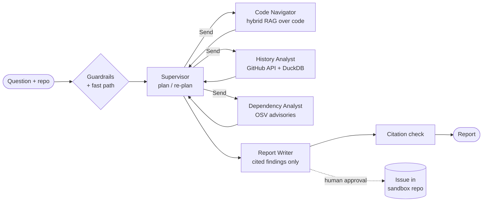

# repolens

> 🚧 **Work in progress.** See the [roadmap](#roadmap) for current status.

Ask questions about any public GitHub repository, such as *"How does auth work here?"*, *"Which modules are the riskiest to change?"* or *"Write an onboarding guide"*. You get back a report where **every claim cites a `file:line` or a commit/PR**.

repolens is a multi-agent system built on LangGraph. A supervisor plans the work, specialist agents investigate in parallel, and the run stays inside a hard per-run cost budget and a set of guardrails.

## Architecture (planned)

- **Plan-and-execute supervisor.** It is built directly on `StateGraph`: independent steps fan out with `Send`, and the supervisor can re-plan up to twice.
- **Cost cap.** Each run has a USD budget. It switches to a cheaper model at 80% and stops gracefully at 100%.
- **Guardrails.** Repo content is scanned for prompt injections and secrets at ingest and always treated as untrusted data. The single write action requires human approval.
- **Verifiable output.** Citations are checked against the analysed commit before a report is returned.

Design decisions are recorded in [`docs/adr/`](docs/adr/).

## Roadmap

- [ ] **M0** Project scaffold, CI, local Postgres
- [ ] **M1** End-to-end slice: ingest a repo snapshot, code Q&A with citations (CLI)
- [ ] **M2** Parallel specialists, re-planning, cost cap, tracing
- [ ] **M3** Guardrails, MCP tools with human approval, evaluation suite
- [ ] **M4** Streaming API + UI, public demo, evaluation results

## License

[MIT](LICENSE)
