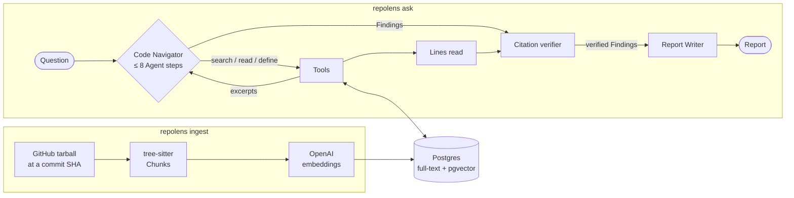

# repolens

**Ask a question about a GitHub repository and get an answer where every claim cites `file:line`, checked against the pinned commit.**

repolens is an agentic code Q&A tool. One agent searches and reads the code until it can answer, a deterministic verifier drops every citation to lines the model wasn't shown, and a pinned eval measures how often it finds the right code. It's plain Python with a small model layer for Gemini and Claude and no agent framework, so every step is explainable.

```console
$ uv run repolens ask fastapi/typer@a80f6e5 "How does typer show help with Rich formatting?"
Snapshot: fastapi/typer@a80f6e5ecd74f32b983cca336a2f3cba98d9853a
Question: How does typer show help with Rich formatting?

Typer replaces the default Click help method with the rich_format_help function to provide Rich-formatted output [1]. This function utilizes a Rich Console to display usage, help text, and panels for arguments, options, and subcommands while supporting Markdown markup [2].

[1] Typer uses the `rich_format_help` function in `typer/rich_utils.py` to replace the default Click `format_help` method, providing Rich-formatted help output.
    typer/rich_utils.py:555-568
    typer/core.py:1208-1217
[2] The `rich_format_help` function uses a Rich `Console` to print usage, help text, and panels for arguments, options, and subcommands, supporting different markup modes like Markdown.
    typer/rich_utils.py:569-687
[3] Typer also provides `rich_format_error` to print Click exceptions using Rich panels and styling.
    typer/rich_utils.py:697-728

2 calls · 5,711 in / 480 out tokens · 22.5s
```

## How it works



- **Snapshots.** A repository is pinned to a commit SHA, downloaded as a tarball and split with tree-sitter into function-, class- and section-level Chunks of its Python and TypeScript code. Each Snapshot is embedded once, so citations stay valid and eval questions stay reproducible.
- **Hybrid search.** Postgres full-text search and pgvector similarity are fused with reciprocal rank fusion, then a small local cross-encoder reranks the candidates.
- **The Code Navigator.** A Run starts with a search for the question. Then each Agent step is one model call that returns one structured action: `search`, `read` lines of a file, `define` a symbol, or `answer` with Findings. There's no native tool calling, so any model that returns JSON works. A Run takes at most 8 steps and is shown at most 1,500 lines.
- **Verified citations.** Every excerpt the model is shown is recorded. A Citation survives only if every cited line was shown and the symbol it names is there. The Report Writer then writes the answer from the verified Findings only.
- **Run log.** Each Run writes a JSON Lines file with every model call (tokens, latency), Agent step, Tool result and rejected Citation to `~/.repolens/runs/`.

Design decisions are recorded in [`docs/adr/`](docs/adr/) and the vocabulary in [`CONTEXT.md`](CONTEXT.md).

## Results

20 questions on two pinned repositories, [`fastapi/typer`](https://github.com/fastapi/typer) (Python) and [`sindresorhus/ky`](https://github.com/sindresorhus/ky) (TypeScript), each with the files and symbols a good answer cites ([`evals/questions.toml`](evals/questions.toml)). One-shot means the model answers from the first search alone. Two runs per setup.

| Model | Setup | File recall | Symbol recall | Citation validity | Input tokens | Run time | Est. cost |
|---|---|---|---|---|---|---|---|
| Gemini 3.1 Flash-Lite | one-shot | 58–64% | 38–43% | 100% | 5,735 | 12.5s | $0.0020 |
| Gemini 3.1 Flash-Lite | agent | 66–71% | 54–59% | 96–100% | 9,926 | 15.4s | $0.0031 |
| Claude Sonnet 5 | one-shot | 52% | 38% | 99–100% | 8,184 | 16.8s | $0.0265 |
| Claude Sonnet 5 | agent | **85–92%** | **88–93%** | 99% | 29,050 | 27.7s | $0.0707 |

Recall and validity are over the questions that got an answer; 5 of 80 Gemini Runs failed with provider overload errors (503) and none of Sonnet 5's. Tokens, time and cost are means per question; cost is estimated at list prices.

- **Searching and reading beats answering from one search.** On Claude Sonnet 5 the agent finds 85–92% of the expected files, against 52% one-shot, for about 3.5x the tokens.
- **Gemini 3.1 Flash-Lite mostly answers at once.** It stopped after the first step in 25 of 38 Runs, so it gains much less from the agent.
- **Citations stay valid.** The verifier kept 96–100% of Citations in every setup.
- **Retrieval still misses some code.** On two ky questions, long test files and type declarations crowd the source out of the search results.

Full tables and analysis: [agent vs one-shot](evals/results/agent.md), and the [one-shot baseline](evals/results/baseline.md) that kept the reranker.

## Quick start

Requires [uv](https://docs.astral.sh/uv/) and Docker. The default chat model, Gemini 3.1 Flash-Lite, runs on Google's free tier; embeddings cost a few cents per repository on OpenAI.

```sh
git clone https://github.com/AnshChhikara001/repolens.git && cd repolens
uv sync
docker compose up -d        # Postgres with pgvector
cp .env.example .env        # add GOOGLE_API_KEY and OPENAI_API_KEY
uv run repolens doctor      # checks the database and keys
uv run repolens ask fastapi/typer "How are CLI options parsed?"
```

`ask` ingests the repository on first use (`repolens ingest` does only that). The reranker model (about 80 MB) downloads on the first Run.

To use Claude, set `CHAT_MODEL=anthropic:claude-sonnet-5` and `ANTHROPIC_API_KEY`. Other settings are listed in [`.env.example`](.env.example).

### Run the eval

```sh
uv run repolens eval              # the agent, up to 8 Agent steps
uv run repolens eval --steps 1    # one-shot
uv run repolens eval --no-rerank  # search order instead of the reranker
```

It prints markdown tables like the ones in [`evals/results/`](evals/results/).

## Development

```sh
uv run pytest               # database tests are skipped if Postgres isn't running
uv run ruff check && uv run ruff format --check
uv run pyright              # strict mode
```

## Roadmap

- [x] **M0** Project scaffold, CI, local Postgres
- [x] **M1** End-to-end slice: ingest a repo snapshot, code Q&A with citations (CLI)
- [ ] **M2** Agentic Q&A, measured: one agent with search, read and define Tools, verified citations, a pinned eval
- [ ] **M3** *(optional)* Git history Tools, guardrails (prompt-injection scan, secret redaction), a hosted demo with a web UI

## License

[MIT](LICENSE)
